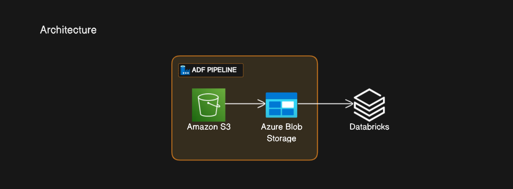

# Industry-Level Azure Data Engineering Project

This project demonstrates an end-to-end Azure Data Engineering solution based on a common business use case. The goal is to transfer data from an Amazon S3 bucket to an Azure Blob container using Azure Data Factory. Subsequently, we'll leverage Azure Databricks to mount the Azure Blob and perform data analytics using Spark SQL.

## Business use case:
We have data coming into Amazon S3 location from external resources and we want to move data to Azure Blob container by using Azure Data Factory pipeline.
Once data transmitted we need to mount it to Databricks and do analysis by using Spark SQL.

## Architecture


## Project Workflow

1. **Create Azure Blob Storage:**
   - Set up an Azure Blob Storage account to store data transferred from Amazon S3.

2. **Create Amazon S3 Bucket:**
   - Set up an Amazon S3 bucket to act as the source for our data.

3. **Azure Data Factory Pipeline:**
   - Develop an Azure Data Factory pipeline to efficiently move data from the Amazon S3 bucket to the Azure Blob container.

4. **Mount Azure Blob Storage to Databricks:**
   - Establish a connection between Azure Databricks and the Azure Blob Storage to facilitate data access.

5. **Data Analytics with Spark SQL:**
   - Leverage Spark SQL on Azure Databricks to perform advanced analytics on the mounted data.

## Steps to Replicate:

### 1. Azure Blob Storage Setup:
   - Follow the Azure documentation to create a Blob Storage account.

### 2. Amazon S3 Bucket Setup:
   - Set up an Amazon S3 bucket using the AWS Management Console.

### 3. Azure Data Factory Pipeline:
   - Develop an Azure Data Factory pipeline to copy data from Amazon S3 to Azure Blob.
   - Utilize appropriate connectors and ensure data integrity during the transfer.

### 4. Mount Azure Blob to Databricks:
   - Configure Azure Databricks to mount the Azure Blob Storage as a DBFS (Databricks File System) directory.
   - 
     ```python
     dbutils.fs.mount(
     source="wasbs://raw@blobstoragesuperstore.blob.core.windows.net",
     mount_point= "/mnt/raw",
     extra_configs={"fs.azure.account.key.blobstoragesuperstore.blob.core.windows.net":"ACCESS_KEY"}
     )
     ```

### 5. Spark SQL Analytics:
   - Leverage Spark SQL on Databricks to analyze and derive insights from the transferred data.
   - Please refer this [SQL Notebook](https://github.com/shubhammirajkar/superstore_azure_de_project/blob/main/superstore%20notebook.sql) for the Spark SQL queries

## Folder Structure:

- `/scripts`: Contains necessary scripts for setup and configuration.
- `/data`: Placeholder for sample or transferred data.
- `/notebooks`: Jupyter notebooks for Spark SQL analytics and exploratory data analysis.

## Additional Resources:

- [Azure Blob Storage Documentation](https://docs.microsoft.com/en-us/azure/storage/blobs/)
- [Amazon S3 Documentation](https://docs.aws.amazon.com/s3/)
- [Azure Data Factory Documentation](https://docs.microsoft.com/en-us/azure/data-factory/)
- [Azure Databricks Documentation](https://docs.microsoft.com/en-us/azure/databricks/)

Feel free to contribute, provide feedback, or adapt this project to suit your specific use cases! 🚀🔍 #Azure #DataEngineering #SparkSQL #ETL #Databricks
